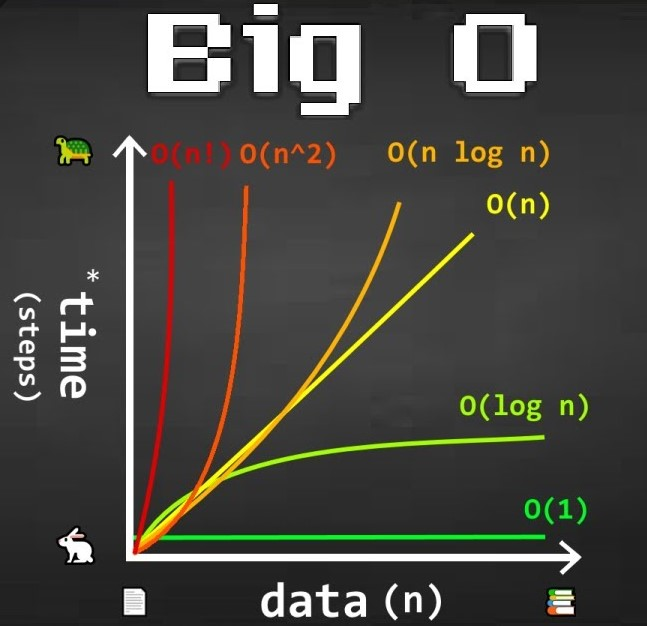

# Big O notation ~ *"how code slows as data grows"*

* Describes the performance of an algorithm as the amount of data increases
* Machine independant
* Ignore smaller operations: O(n + 1) -> O(n), where n = amount of data

<br>

<p align="center" style="font-weight: bold; font-size: 24px">Examples of time complexities</p>

<p align="center"></p>

<br>

## O(1) constant time

This time complexity takes the same amount of time every time now matter how big the data is

Example:

```C
/**
 * sum - sums up all the numbers from [1, n]
 */
int sum(int n)
{
    int sum = n * (n + 1) / 2

    return sum;
}

// if n = 1 000 000 or n = 10
// 3 steps taken always
```

## O (log n) logarithmic time

the rate at which the time complexity increases, decreases as the data grows

Example:

* binary search

## O(n) linear time

This time complexity is dependant of the size of the data and grows linearly as data size increases

Example:

* traversing an array
* searching a linked list

```C
/**
 * sum - sums up all the numbers from [1, n]
 */
int sum(int n)
{
    int sum = 0;
    for (int i = 1; i <= n; i++)
        sum += i;

    return sum;
}
// if n = 1 000 000
// ≈ 1 000 000 steps taken
// if n = 10
// ≈ 10 steps taken
```

## O(n log n) Quasilinear time

time complexity is linear for smaller data sets, but as data set starts to increase

Examples:

* quicksort
* mergesort
* heapsort

## O(n ^ 2) Quadratic time

time complexity accelerates as data set size increase.

Examples:

* bubble sort
* selection sort
* insertion sort

## O(n!) factorial time

time complexity is drastically accelerated with increasing data sets. It is extremely slow

Examples:

* Traveling salesman problem
