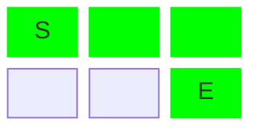
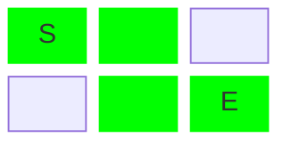
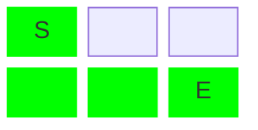

### grid path 1

```mermaid
block-beta
columns 3

a["&nbsp;&nbsp&nbsp;S&nbsp &nbsp;"]
b["&nbsp;&nbsp&nbsp;&nbsp;&nbsp &nbsp;"]
c["&nbsp;&nbsp&nbsp;&nbsp;&nbsp &nbsp;"]
d["&nbsp;&nbsp&nbsp;&nbsp;&nbsp &nbsp;"]
e["&nbsp;&nbsp&nbsp;&nbsp;&nbsp &nbsp;"]
f["&nbsp;&nbsp&nbsp;E&nbsp &nbsp;"]

classDef base fill:black,stroke:black,thickness:4
classDef path fill:lime,stroke:lime,color:black

class a,b,c,f path

```

### grid path 2

```mermaid
block-beta
columns 3

a["&nbsp;&nbsp&nbsp;S&nbsp &nbsp;"]
b["&nbsp;&nbsp&nbsp;&nbsp;&nbsp &nbsp;"]
c["&nbsp;&nbsp&nbsp;&nbsp;&nbsp &nbsp;"]
d["&nbsp;&nbsp&nbsp;&nbsp;&nbsp &nbsp;"]
e["&nbsp;&nbsp&nbsp;&nbsp;&nbsp &nbsp;"]
f["&nbsp;&nbsp&nbsp;E&nbsp &nbsp;"]

classDef base fill:black,stroke:black,thickness:4
classDef path fill:lime,stroke:lime,color:black

class a,b,e,f path

```

### grid path 1

```mermaid
block-beta
columns 3

a["&nbsp;&nbsp&nbsp;S&nbsp &nbsp;"]
b["&nbsp;&nbsp&nbsp;&nbsp;&nbsp &nbsp;"]
c["&nbsp;&nbsp&nbsp;&nbsp;&nbsp &nbsp;"]
d["&nbsp;&nbsp&nbsp;&nbsp;&nbsp &nbsp;"]
e["&nbsp;&nbsp&nbsp;&nbsp;&nbsp &nbsp;"]
f["&nbsp;&nbsp&nbsp;E&nbsp &nbsp;"]

classDef base fill:black,stroke:black,thickness:4
classDef path fill:lime,stroke:lime,color:black

class a,d,e,f path

```

### Count: 3 paths
