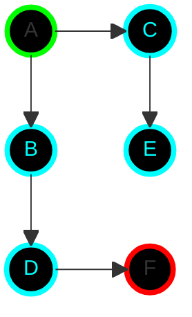
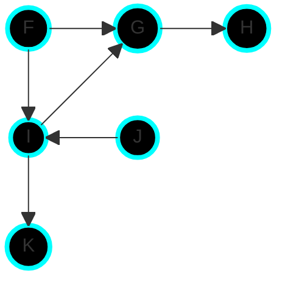
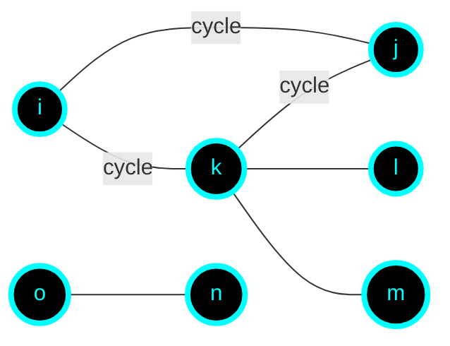
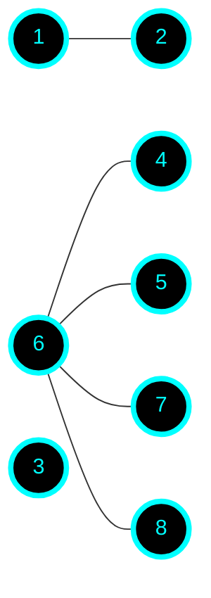
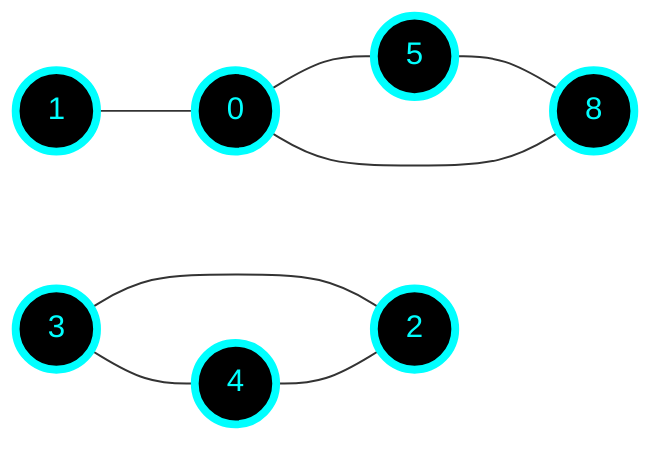
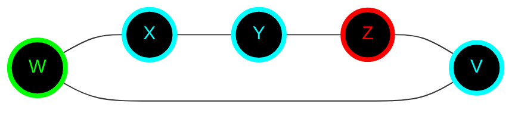

## DFS && BFS

### Graph 1

start: A end: F

`DFS: a,b,d,f,c,e`

`BFS: a,b,c,d,e,f`

### Graph 2

start: F end: K

### Graph 3

### Graph 4

### Graph 5

### Graph 6

#### Start: W
#### End: Z
#### Shortest Path: 2 &nbsp; &nbsp; &nbsp; {w, v, z}

### Graph 7 (island count)

6 x 6 grid

&nbsp; &nbsp; 0 &nbsp; &nbsp; &nbsp; &nbsp;&nbsp; 1 &nbsp; &nbsp; &nbsp; &nbsp;&nbsp; 2 &nbsp; &nbsp; &nbsp; &nbsp;&nbsp; 3 &nbsp; &nbsp; &nbsp; &nbsp;&nbsp; 4 &nbsp; &nbsp; &nbsp; &nbsp;&nbsp; 5

```mermaid
block-beta
columns 6

0["&nbsp;&nbsp;&nbsp;&nbsp;&nbsp;&nbsp;"]
1["<font class='orange'>&nbsp;&nbsp;&nbsp;&nbsp;&nbsp;&nbsp;</font>"]
2["&nbsp;&nbsp;&nbsp;&nbsp;&nbsp;&nbsp;"]
3["&nbsp;&nbsp;&nbsp;&nbsp;&nbsp;&nbsp;"]
4["&nbsp;&nbsp;&nbsp;&nbsp;&nbsp;&nbsp;"]
5["&nbsp;&nbsp;&nbsp;&nbsp;&nbsp;&nbsp;"]
6["&nbsp;&nbsp;&nbsp;&nbsp;&nbsp;&nbsp;"]
7["&nbsp;&nbsp;&nbsp;&nbsp;&nbsp;&nbsp;"]
8["&nbsp;&nbsp;&nbsp;&nbsp;&nbsp;&nbsp;"]
9["&nbsp;&nbsp;&nbsp;&nbsp;&nbsp;&nbsp;"]
10["&nbsp;&nbsp;&nbsp;&nbsp;&nbsp;&nbsp;"]
11["&nbsp;&nbsp;&nbsp;&nbsp;&nbsp;&nbsp;"]
12["&nbsp;&nbsp;&nbsp;&nbsp;&nbsp;&nbsp;"]
13["&nbsp;&nbsp;&nbsp;&nbsp;&nbsp;&nbsp;"]
14["&nbsp;&nbsp;&nbsp;&nbsp;&nbsp;&nbsp;"]
15["&nbsp;&nbsp;&nbsp;&nbsp;&nbsp;&nbsp;"]
16["&nbsp;&nbsp;&nbsp;&nbsp;&nbsp;&nbsp;"]
17["&nbsp;&nbsp;&nbsp;&nbsp;&nbsp;&nbsp;"]
18["&nbsp;&nbsp;&nbsp;&nbsp;&nbsp;&nbsp;"]
19["&nbsp;&nbsp;&nbsp;&nbsp;&nbsp;&nbsp;"]
20["&nbsp;&nbsp;&nbsp;&nbsp;&nbsp;&nbsp;"]
21["&nbsp;&nbsp;&nbsp;&nbsp;&nbsp;&nbsp;"]
22["&nbsp;&nbsp;&nbsp;&nbsp;&nbsp;&nbsp;"]
23["&nbsp;&nbsp;&nbsp;&nbsp;&nbsp;&nbsp;"]
24["&nbsp;&nbsp;&nbsp;&nbsp;&nbsp;&nbsp;"]
25["&nbsp;&nbsp;&nbsp;&nbsp;&nbsp;&nbsp;"]
26["&nbsp;&nbsp;&nbsp;&nbsp;&nbsp;&nbsp;"]
27["&nbsp;&nbsp;&nbsp;&nbsp;&nbsp;&nbsp;"]
28["&nbsp;&nbsp;&nbsp;&nbsp;&nbsp;&nbsp;"]
29["&nbsp;&nbsp;&nbsp;&nbsp;&nbsp;&nbsp;"]
30["&nbsp;&nbsp;&nbsp;&nbsp;&nbsp;&nbsp;"]
31["&nbsp;&nbsp;&nbsp;&nbsp;&nbsp;&nbsp;"]
32["&nbsp;&nbsp;&nbsp;&nbsp;&nbsp;&nbsp;"]
33["&nbsp;&nbsp;&nbsp;&nbsp;&nbsp;&nbsp;"]
34["&nbsp;&nbsp;&nbsp;&nbsp;&nbsp;&nbsp;"]
35["&nbsp;&nbsp;&nbsp;&nbsp;&nbsp;&nbsp;"]

style 0 fill:blue,stroke-width:0px
style 1 fill:orange,stroke-width:0px
style 2 fill:blue,stroke-width:0px
style 3 fill:blue,stroke-width:0px
style 4 fill:orange,stroke-width:0px
style 5 fill:blue,stroke-width:0px
style 6 fill:orange,stroke-width:0px
style 7 fill:orange,stroke-width:0px
style 8 fill:blue,stroke-width:0px
style 9 fill:blue,stroke-width:0px
style 10 fill:orange,stroke-width:0px
style 11 fill:blue,stroke-width:0px
style 12 fill:blue,stroke-width:0px
style 13 fill:orange,stroke-width:0px
style 14 fill:blue,stroke-width:0px
style 15 fill:blue,stroke-width:0px
style 16 fill:blue,stroke-width:0px
style 17 fill:blue,stroke-width:0px
style 18 fill:blue,stroke-width:0px
style 19 fill:blue,stroke-width:0px
style 20 fill:blue,stroke-width:0px
style 21 fill:orange,stroke-width:0px
style 22 fill:orange,stroke-width:0px
style 23 fill:blue,stroke-width:0px
style 24 fill:blue,stroke-width:0px
style 25 fill:orange,stroke-width:0px
style 26 fill:blue,stroke-width:0px
style 27 fill:orange,stroke-width:0px
style 28 fill:orange,stroke-width:0px
style 29 fill:blue,stroke-width:0px
style 30 fill:blue,stroke-width:0px
style 31 fill:blue,stroke-width:0px
style 32 fill:blue,stroke-width:0px
style 33 fill:blue,stroke-width:0px
style 34 fill:blue,stroke-width:0px
style 35 fill:blue,stroke-width:0px
```

