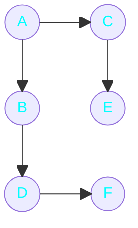

## DFS && BFS

### Graph 1

```mermaid
  block-beta
  columns 3
  A(("<font color='cyan'>&nbsp;&nbsp;A&nbsp;&nbsp;</font>")) space C(("<font color='cyan'>&nbsp;&nbsp;C&nbsp;&nbsp;</font>"))
  space space space
  B(("<font color='cyan'>&nbsp;&nbsp;B&nbsp;&nbsp;</font>")) space E(("<font color='cyan'>&nbsp;&nbsp;E&nbsp;&nbsp;</font>"))
  space space space
  D(("<font color='cyan'>&nbsp;&nbsp;D&nbsp;&nbsp;</font>")) space F(("<font color='cyan'>&nbsp;&nbsp;F&nbsp;&nbsp;</font>"))
  A-->C
  C-->E
  A-->B
  D-->F
  B-->D
```

`DFS: a,b,d,f,c,e`

`BFS: a,b,c,d,e,f`
