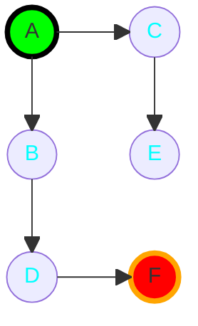
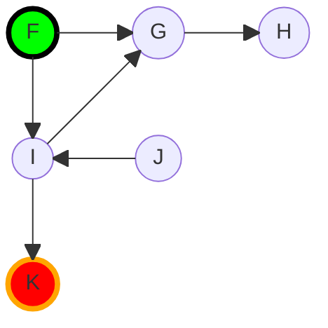

## DFS && BFS

### Graph 1

start: A end: F

```mermaid
  block-beta
  columns 3
  A(("&nbsp;&nbsp;A&nbsp;&nbsp;")) space C(("<font color='cyan'>&nbsp;&nbsp;C&nbsp;&nbsp;</font>"))
  space space space
  B(("<font color='cyan'>&nbsp;&nbsp;B&nbsp;&nbsp;</font>")) space E(("<font color='cyan'>&nbsp;&nbsp;E&nbsp;&nbsp;</font>"))
  space space space
  D(("<font color='cyan'>&nbsp;&nbsp;D&nbsp;&nbsp;</font>")) space F(("&nbsp;&nbsp;F&nbsp;&nbsp;"))
  A-->C
  C-->E
  A-->B
  D-->F
  B-->D

  style A fill:lime,stroke:black,stroke-width:4px,color:black
  style F fill:red,stroke:orange,stroke-width:4px,color:white
```

`DFS: a,b,d,f,c,e`

`BFS: a,b,c,d,e,f`

### Graph 2

start: F end: K

```mermaid
  block-beta
  columns 5
  F(("&nbsp;&nbsp;F&nbsp;&nbsp;")) space G(("&nbsp;&nbsp;G&nbsp;&nbsp;")) space H(("&nbsp;&nbsp;H&nbsp;&nbsp;"))
  space space space space space
  I(("&nbsp;&nbsp;I&nbsp;&nbsp;")) space J(("&nbsp;&nbsp;J&nbsp;&nbsp;"))
  space space space space space space space
  K(("&nbsp;&nbsp;K&nbsp;&nbsp;"))

  F-->G
  G-->H
  F-->I
  I-->G
  J-->I
  I-->K

  style F fill:lime,stroke:black,stroke-width:4px,color:black
  style K fill:red,stroke:orange,stroke-width:4px,color:white
```
