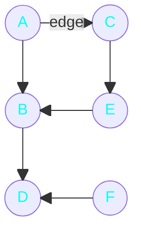
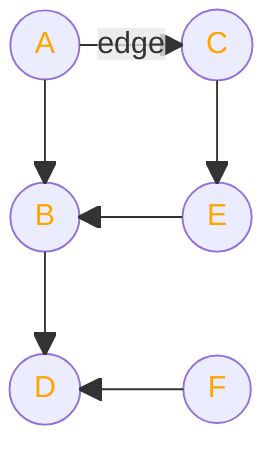

<h1 align="center">Graphs</h1>

## What is a Graph?
graph = $\color{cyan}{nodes}$ + $\color{yellow}{edges}$ &nbsp;&nbsp;&nbsp;&nbsp;&nbsp;&nbsp;&nbsp;&nbsp;&nbsp;&nbsp;  (collection of nodes and edges)

### $\color{cyan}{directed\ graph}$ 

### $\color{orange}{undirected\ graph}$ 

